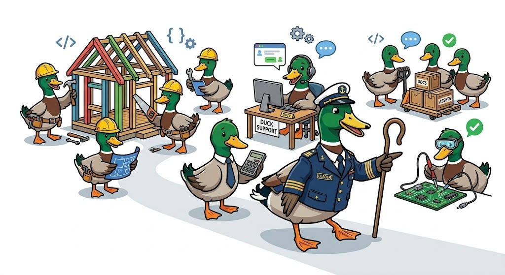

---
hide:
  - navigation
---

# dux 🦆

<em>Fast harness for agents. Latin for "guide". Short enough for the CLI!</em>

---

Dux is a lightning-fast, highly modular execution engine for running and testing Large Language Model (LLM) agents locally. Build and iterate on intricate provider streams, tool abstractions, and recursive convergence loops straight from the synchronous terminal or by embedding it as a native Go library.

## Key Features

- **Rich Agentic TUI**: Run `dux chat` completely locally. Dux's beautiful `bubbletea` powered terminal UI renders responsive Markdown and distinctly tracks "thinking" (reasoning) tokens in real time.
- **Dual-Use Architecture**: Designed as a scalable, standalone Go core (`pkg/`). Use the Dux execution engine effortlessly within your own Go applications, or run it out-of-the-box via the CLI.
- **Declarative Agent Specifications**: Decouple system prompts, contextual enrichments, and provider mappings using lightweight `agents/<agent-name>/agent.yaml` specifications.
- **Strictly Typed Tool Abstractions**: Write Go functions and easily export them to LLMs directly via standard JSON Schema mappings natively supported by Go interfaces.
- **Agnostic LLM Engine**: Implemented via a deep recursive `adapter` mapping sequence, allowing your pipeline to scale continuously across `static` testing mocks, raw `ollama` daemon inference endpoints, LiteLLM gateways, and beyond!
- **Dynamic Viper Configurations**: Connect any provider natively via `config.yaml` using powerful generic ID-based mappings without muddying CLI source boundaries.

## Where to go next?

Explore the documentation through its Diátaxis structure:

- 🎓 **[Tutorials](tutorials/openai-compatible.md)**: Step-by-step guides for core concepts and generic integrations.
- 🔨 **[Examples](examples/customer-feedback-agent.md)**: Complete, real-world example agents you can build and run.
- 🚀 **[How-To Guides](how-to/running-locally.md)**: Target guides for local configuration, agent definitions, and building.
- 📖 **[Reference](reference/cli.md)**: API specifications and CLI Commands.
- 🧠 **[Explanation](explanation/architecture.md)**: Deep dives into the LLM "convergence loop" theory and architecture abstractions.
